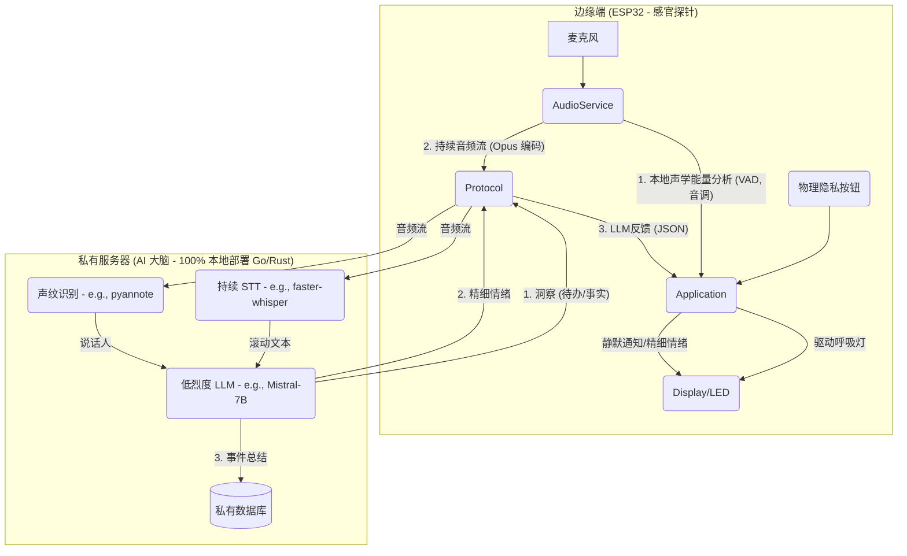

# 心镜 (Heart Mirror)

## 愿景 (Vision)

“心镜”是一个 100% 私有化、用于自我觉察和认知增强的环境 AI。

它不是一个助手，而是一面镜子。

市面上所有的 AI 助手都是“命令驱动”的仆人：您下达指令，它执行任务。这满足了“效率”，但忽略了一个更深层次的需求：我们对自己实时的情绪和精神状态，其实非常“无知”。

“心镜”的核心价值不是“服务”，而是“自省”。它是一个环境计算设备，其唯一目标是：

- 绝对私密地感知您所处的环境。

- 被动地、静默地为您分析和量化您的状态。

## 核心原则 (Core Principles)

- 隐私基石 (Privacy-First)：任何原始音频数据永远不会离开您的私有网络。所有 AI 分析均在您的私有服务器（如 NAS、NUC 或家用服务器）上运行的本地 LLM/STT 模型上完成。

- 用户主权 (User Sovereignty)：用户必须能在首次启动时，通过透明的界面（WiFi 门户）自由配置自己的 WiFi 凭据（包括 WPA2-Enterprise 用户名）和私有服务器地址。

- 被动感知 (Passive Perception)：设备的主要模式不是等待唤醒词，而是持续地、低功耗地感知环境。

- 环境计算 (Ambient Computation)：反馈是静默且非侵入性的。Display 主要用于“氛围灯”和“无声通知”，而非吵闹的语音播报。

## 核心架构：边缘（探针）+ 私服（大脑）



## 功能特性 (Features)

- 可配置的私有部署 (Configurable Private Deployment)：在首次启动时，设备将进入配置门户（Captive Portal），允许用户输入 WPA2-Enterprise（用户名 + 密码）凭据，以及自定义的私有服务器 WebSocket URL。

- 本地能量呼吸灯 (Local Energy Breathing Light)：ESP32 在本地持续分析声学“能量”（语音密度、音调起伏），而非猜测情绪。Display 以此为依据，呈现一个非侵入性的“环境氛围灯”。

- 精细情绪反馈 (Fine-grained Emotion Feedback)：私有 LLM 实时分析您的内容（例如识别到“愤怒”词汇），并立即决策一个“反馈”情绪。它会发送一个 xiaozhi 原生支持的指令（{"type": "llm", "emotion": "fear"}），使设备立即显示“恐惧”或“安抚”的表情。

- 情绪日志 (Emotion Log)：私有 LLM 结合文本内容和说话人声纹，判断“强情绪事件”，并将其（例如 `[李四]: 愤怒 - "..."`）存入您的私有数据库，供您日后回顾。

- 物理隐私开关 (Physical Privacy Switch)：一个物理按钮，按下后立即在固件层停止 AudioService 的音频流传输，Display 必须显示“已静音”图标，100% 保证用户信任。

## 里程碑 (Milestone)

### Milestone 1: 核心管道（持续串流与转录）

**目标**：实现 ESP32 到私有服务器的 7x24 持续音频流，并在服务器端成功转录为文本。

#### Task F-1.1 (固件): 实现“心镜”模式与持续串流

- **描述**：在 `application.h` 中添加新状态 `kDeviceStateHeartMirror`。实现一个按钮（如 `ToggleChatState`）来进入此模式。
- **行动**：修改 `SetDeviceState`：当进入 `kDeviceStateHeartMirror` 状态时，调用 `audio_service_.EnableVoiceProcessing(true)` 和 `protocol_->OpenAudioChannel()`。这将自动、持续地触发 `MAIN_EVENT_SEND_AUDIO` 事件，从而复用 `protocol_->SendAudio()` 管道。

#### Task S-1.1 (服务器): 构建音频接收服务 (Go/Rust)

- **描述**：使用 Go（`gorilla/websocket`）或 Rust（`tungstenite`）构建一个 WebSocket 服务器，以接收 M-0.4 中配置的 URL 连接。
- **行动**：服务器必须能解析 xiaozhi 的音频包（JSON 头 + Opus 二进制包）。

服务器已经构建成功，README 为：

---

# 心镜大脑 (Heart Mirror Brain)

一个基于 Rust 的实时语音识别与情绪分析服务器，通过 WebSocket 接收音频流，使用 Whisper 进行语音转文字，并通过 Ollama LLM 分析情绪。

## 功能特性

- 🎤 **实时语音识别**：支持中文语音实时转文字
- 😊 **情绪分析**：分析文本情绪（喜悦、愤怒、悲伤、恐惧、平静、中性、睡眠）
- 🔊 **音频处理**：Opus 编码解码，语音活动检测 (VAD)
- 💾 **数据存储**：SQLite 数据库记录所有识别结果
- 🌐 **WebSocket 协议**：实时双向通信
- 🚀 **高性能**：Rust 实现，多线程处理

## 系统架构

```
┌─────────────┐   音频流    ┌─────────────┐   文本    ┌─────────────┐
│  客户端设备  │ ──────────> │ 心镜大脑服务器 │ ───────> │ 情绪分析    │
│  (iOS/Android)│           │ (Rust/Axum)  │           │ (Ollama)    │
└─────────────┘   WebSocket └─────────────┘           └─────────────┘
                         │                              │
                         │ 识别结果 + 情绪              │
                         └──────────────────────────────┘
                                    │
                                    ▼
                           ┌─────────────┐
                           │ SQLite 数据库 │
                           │ (历史记录)    │
                           └─────────────┘
```

## 快速开始

### 环境要求

1. **Rust 工具链** (stable)
   ```bash
   curl --proto '=https' --tlsv1.2 -sSf https://sh.rustup.rs | sh
   ```

2. **Ollama** (本地 LLM 服务)
   ```bash
   # macOS/Linux
   curl -fsSL https://ollama.com/install.sh | sh

   # 下载并运行模型
   ollama run qwen2.5:1.5b
   ```

3. **Whisper 模型文件**
   - 下载中文模型：`ggml-base.bin`
   - 或英文模型：`ggml-base.en.bin`
   - 放置到项目根目录

### 安装与运行

```bash
# 克隆项目
git clone <repository-url>
cd xinjing_web

# 放置模型文件 (从 huggingface 或其他来源下载)
# 例如：将 ggml-base.bin 放在项目根目录

# 构建项目
cargo build --release

# 运行服务器
cargo run --release
```

服务器启动后监听 `0.0.0.0:4321`。

## 交互协议

### WebSocket 连接

- **端点**: `ws://<服务器地址>:4321/ws`
- **编码**: JSON + 二进制音频数据

### 消息格式

#### 1. 客户端 → 服务器

**文本消息 (JSON)**
```json
{
  "type": "hello",
  "version": "1.0.0"
}
```

```json
{
  "type": "event",
  "key": "app_state",
  "value": "foreground"
}
```

**音频消息 (二进制)**
- Opus 编码的音频数据
- 16kHz 采样率，单声道
- 实时流式传输

#### 2. 服务器 → 客户端

**初始连接响应**
```json
{
  "type": "llm",
  "emotion": "calm",
  "text": "Connected & Ready"
}
```

**语音识别结果**
```json
{
  "type": "llm",
  "emotion": "joy",
  "text": "今天天气真好"
}
```

**心跳响应**
```
pong
```

### 消息类型说明

| 类型 | 方向 | 说明 |
|------|------|------|
| `hello` | 客户端→服务器 | 握手消息，包含版本号 |
| `event` | 客户端→服务器 | 应用状态事件 |
| `llm` | 服务器→客户端 | 语音识别和情绪分析结果 |
| `ping` | 客户端→服务器 | 心跳检测 |
| `pong` | 服务器→客户端 | 心跳响应 |

### 音频处理流程

1. **编码**: 客户端使用 Opus 编码压缩音频
2. **传输**: 通过 WebSocket 二进制帧发送
3. **解码**: 服务器解码为 PCM 数据
4. **VAD**: 语音活动检测，分割完整语句
5. **识别**: Whisper 模型转文字
6. **分析**: Ollama 分析情绪
7. **响应**: 返回 JSON 结果

## 数据库结构

### 表：`speech_results`

| 字段 | 类型 | 说明 |
|------|------|------|
| `id` | INTEGER | 主键，自增 |
| `text` | TEXT | 识别的文本内容 |
| `emotion` | TEXT | 分析的情绪结果 |
| `created_at` | TEXT | 创建时间 (ISO 8601，上海时区) |

### 查询示例

```sql
-- 查询所有记录
SELECT * FROM speech_results ORDER BY created_at DESC;

-- 按情绪统计
SELECT emotion, COUNT(*) as count
FROM speech_results
GROUP BY emotion
ORDER BY count DESC;

-- 查询特定日期的记录
SELECT * FROM speech_results
WHERE date(created_at) = '2024-01-15';
```

## 客户端实现示例

### JavaScript WebSocket 客户端

```javascript
class HeartMirrorClient {
  constructor(url = 'ws://localhost:4321/ws') {
    this.ws = new WebSocket(url);
    this.setupEventHandlers();
  }

  setupEventHandlers() {
    this.ws.onopen = () => {
      console.log('连接到心镜大脑');
      // 发送握手消息
      this.sendHandshake('1.0.0');
    };

    this.ws.onmessage = (event) => {
      if (typeof event.data === 'string') {
        this.handleTextMessage(event.data);
      } else {
        this.handleAudioMessage(event.data);
      }
    };

    this.ws.onclose = () => {
      console.log('连接断开');
    };
  }

  sendHandshake(version) {
    const message = {
      type: 'hello',
      version: version,
    };
    this.ws.send(JSON.stringify(message));
  }

  sendAudio(audioData) {
    // audioData 应该是 Opus 编码的 ArrayBuffer
    this.ws.send(audioData);
  }

  sendEvent(key, value) {
    const message = {
      type: 'event',
      key: key,
      value: value,
    };
    this.ws.send(JSON.stringify(message));
  }

  handleTextMessage(data) {
    try {
      const message = JSON.parse(data);
      switch (message.type) {
        case 'llm':
          console.log(`识别结果：${message.text}`);
          console.log(`情绪：${message.emotion}`);
          break;
        default:
          console.log('收到消息：', message);
      }
    } catch (e) {
      // 可能是心跳响应 "pong"
      if (data === 'pong') {
        console.log('心跳响应');
      }
    }
  }

  // 心跳检测
  startHeartbeat(interval = 30000) {
    setInterval(() => {
      if (this.ws.readyState === WebSocket.OPEN) {
        this.ws.send('ping');
      }
    }, interval);
  }
}
```

### iOS Swift 示例 (核心部分)

```swift
import Foundation
import WebSocketKit

class HeartMirrorClient {
    private var webSocket: URLSessionWebSocketTask?
    private let serverURL = URL(string: "ws://localhost:4321/ws")!

    func connect() {
        let session = URLSession(configuration: .default)
        webSocket = session.webSocketTask(with: serverURL)
        webSocket?.resume()

        receiveMessage()
        sendHandshake()
    }

    private func sendHandshake() {
        let handshake = [
            "type": "hello",
            "version": "1.0.0"
        ]

        do {
            let data = try JSONSerialization.data(withJSONObject: handshake)
            webSocket?.send(.data(data)) { error in
                if let error = error {
                    print("握手失败：\(error)")
                }
            }
        } catch {
            print("JSON 序列化失败：\(error)")
        }
    }

    func sendAudio(_ audioData: Data) {
        webSocket?.send(.data(audioData)) { error in
            if let error = error {
                print("音频发送失败：\(error)")
            }
        }
    }

    private func receiveMessage() {
        webSocket?.receive { [weak self] result in
            switch result {
            case .success(let message):
                switch message {
                case .data(let data):
                    self?.handleBinaryMessage(data)
                case .string(let text):
                    self?.handleTextMessage(text)
                @unknown default:
                    break
                }

                // 继续接收下一条消息
                self?.receiveMessage()

            case .failure(let error):
                print("接收消息失败：\(error)")
            }
        }
    }

    private func handleTextMessage(_ text: String) {
        if text == "pong" {
            print("收到心跳响应")
            return
        }

        guard let data = text.data(using: .utf8) else { return }

        do {
            if let json = try JSONSerialization.jsonObject(with: data) as? [String: Any],
               let type = json["type"] as? String,
               type == "llm" {

                let emotion = json["emotion"] as? String ?? "unknown"
                let text = json["text"] as? String ?? ""

                print("识别结果：\(text)")
                print("情绪：\(emotion)")

                // 更新 UI 或处理结果
                DispatchQueue.main.async {
                    // self.updateUI(text: text, emotion: emotion)
                }
            }
        } catch {
            print("JSON 解析失败：\(error)")
        }
    }

    private func handleBinaryMessage(_ data: Data) {
        // 处理二进制消息（如果需要）
        print("收到二进制数据：\(data.count) bytes")
    }
}
```

## 配置参数

### 服务器配置 (代码中硬编码)

| 参数 | 值 | 位置 |
|------|-----|------|
| 监听地址 | `0.0.0.0:4321` | `src/main.rs:27` |
| Whisper 模型 | `ggml-base.bin` | `src/main.rs:19` |
| Ollama 模型 | `qwen2.5:1.5b` | `src/emotion.rs:29` |
| Ollama 地址 | `http://127.0.0.1:11434` | `src/emotion.rs:73` |
| 数据库文件 | `history-emotion.db` | `src/protocol.rs:49` |

### 音频参数

| 参数 | 值 | 说明 |
|------|-----|------|
| 采样率 | 16kHz | Opus 解码参数 |
| 声道 | 单声道 | 语音识别要求 |
| VAD 启动阈值 | 800.0 | 开始录音的能量阈值 |
| VAD 结束阈值 | 500.0 | 结束录音的能量阈值 |
| 最大静音帧数 | 12 | 约 240ms 静音后结束 |

## 开发指南

### 项目结构

```
xinjing_web/
├── src/
│   ├── main.rs          # 服务器入口点
│   ├── websocket.rs     # WebSocket 处理器
│   ├── speech.rs        # Whisper 语音识别
│   ├── emotion.rs       # Ollama 情绪分析
│   ├── audio.rs         # Opus 解码和 VAD
│   └── protocol.rs      # 消息协议和数据库
├── Cargo.toml          # Rust 依赖配置
├── ggml-base.bin       # Whisper 模型文件
└── history-emotion.db  # SQLite 数据库
```

### 添加新功能

1. **扩展消息协议**
   - 在 `protocol.rs` 中添加新的消息类型
   - 在 `websocket.rs` 中添加对应的处理器

2. **添加新的分析模块**
   - 创建新的模块文件
   - 在 `main.rs` 中初始化并传递到处理器

3. **修改音频处理**
   - 调整 `audio.rs` 中的 VAD 参数
   - 修改音频格式或编码方式

### 调试技巧

1. **检查 Ollama 连接**
   ```bash
   curl http://127.0.0.1:11434/api/generate -d '{
     "model": "qwen2.5:1.5b",
     "prompt": "测试",
     "stream": false
   }'
   ```

2. **查看服务器日志**
   ```bash
   RUST_LOG=info cargo run
   ```

3. **检查数据库内容**
   ```bash
   sqlite3 history-emotion.db
   .tables
   SELECT * FROM speech_results LIMIT 10;
   ```

## 故障排除

### 常见问题

1. **模型文件找不到**
   ```
   错误：找不到模型 'ggml-base.bin'
   ```
   **解决方案**: 下载模型文件并放置在项目根目录

2. **Ollama 连接失败**
   ```
   ❌ Ollama 连接失败
   ```
   **解决方案**:
   - 确保 Ollama 服务正在运行：`ollama serve`
   - 检查端口 11434 是否被占用
   - 安装所需模型：`ollama run qwen2.5:1.5b`

3. **音频识别效果差**
   **解决方案**:
   - 确保音频为 16kHz 单声道
   - 调整客户端麦克风增益
   - 在安静环境下使用

4. **内存占用过高**
   **解决方案**:
   - 使用 `--release` 模式运行
   - 减少 Whisper 线程数 (`speech.rs:59`)
   - 调整音频缓冲区大小 (`audio.rs:20`)

### 性能优化

1. **编译优化**
   ```bash
   # 使用发布模式
   cargo build --release

   # 启用链接时优化
   # 在 Cargo.toml 中添加：
   # [profile.release]
   # lto = true
   # codegen-units = 1
   ```

2. **运行时优化**
   - 根据 CPU 核心数调整 Whisper 线程
   - 优化 VAD 参数减少误触发
   - 使用连接池管理数据库连接

## 许可证

本项目采用 MIT 许可证。详见 [LICENSE](LICENSE) 文件。

## 贡献指南

欢迎提交 Issue 和 Pull Request。在提交代码前，请确保：

1. 代码通过 `cargo fmt` 格式化
2. 通过 `cargo clippy` 检查
3. 添加适当的测试（如果适用）
4. 更新相关文档

## 联系方式

如有问题或建议，请通过以下方式联系：

- GitHub Issues: [项目 Issues 页面]
- 电子邮件：[你的邮箱]

---

**心镜大脑** - 让机器理解你的心声 ❤️

#### Task S-1.2 (服务器): 集成 STT 管道

- **描述**：将接收到的 Opus 音频流解码并送入本地 STT 引擎。
- **行动**：使用 libopus 的 FFI (C 绑定) 解码 Opus 数据包，并将 PCM 音频流实时喂给本地 faster-whisper 实例。
- **验证**：能够在服务器控制台看到 ESP32 端生成的实时滚动字幕。

### Milestone 2: 双向反馈（呼吸灯与精细情绪）

**目标**：实现 ESP32 端的本地能量分析，并打通从“私服 LLM”到“ESP32 表情”的精细反馈。

#### Task F-2.1 (固件): 本地能量呼吸灯

- **描述**：`AudioService` 在串流（M-1.1）的同时，也进行本地计算。
- **行动**：
  1. 修改 `audio_service.cc`，利用 `esp-sr` 的 VAD 状态计算一个滚动的“声学能量”指标（如语音密度）。
  2. `Application` 定期获取此指标，并将其映射为颜色，调用 `display->SetEmotion` 来驱动 Display 氛围灯。

#### Task S-2.1 (服务器): 集成 LLM 与情绪 Prompt

- **描述**：将 STT 文本流（来自 S-1.2）输入到本地 LLM（例如 llama.cpp 的 Go/Rust 绑定）。
- **行动**：编写 Prompt，使 LLM 能从输入文本中识别“高能量”情绪（如“愤怒”、“喜悦”），并决策一个“反馈”情绪（如“恐惧”）。

#### Task S-2.2 (服务器): 实现“精细情绪”反馈

- **描述**：将 LLM 的决策（JSON）发回给 ESP32。
- **行动**：服务器向 ESP32 发送一个标准 xiaozhi 格式的 JSON 指令：`{"type": "llm", "emotion": "fear"}`。
- **验证**：`Application::OnIncomingJson` 无需修改即可自动解析此指令，并调用 `display->SetEmotion("fear")`，使屏幕立即显示表情。

### Milestone 3: 信任与日志（隐私闭环）

**目标**：实现物理隐私开关，并开始进行有意义的长期日志记录。

#### Task F-3.1 (固件): 物理隐私开关

- **描述**：实现一个绝对可靠的“关闭”功能。
- **行动**：
  1. 在 `heart_mirror_board.h` (来自 M-0.1) 中定义一个 `PRIVACY_BUTTON_GPIO`。
  2. 在 `Application::Start` 中为此 GPIO 注册一个中断。
  3. 中断处理函数应立即调用（或通过 Schedule 调用）一个函数，该函数：
      - 停止 AudioService（`EnableVoiceProcessing(false)`）。
      - 关闭 Protocol 的音频通道。
      - 调用 `display->SetEmotion("sleep")` 或显示“静音”图标。

#### Task S-3.1 (服务器): 集成声纹识别

- **描述**：在 STT（S-1.2）的同时，运行声纹识别，以便 LLM 知道“谁在说话”。
- **行动**：集成 pyannote.audio（或同类库），将 STT 输出从 "..." 升级为 "[Speaker_A]: ..."。将此信息提供给 LLM（S-3.1）。

#### Task S-3.2 (服务器): 事件日志数据库

- **描述**：LLM 识别出的“强情绪事件”需要被持久化。
- **行动**：
  1. 在服务器端设置一个数据库（例如 PostgreSQL 或 SQLite）。
  2. 当 LLM（S-3.1）识别到高能量情绪时，将 `{timestamp, speaker, emotion_label, transcript_snippet}` 写入数据库。
