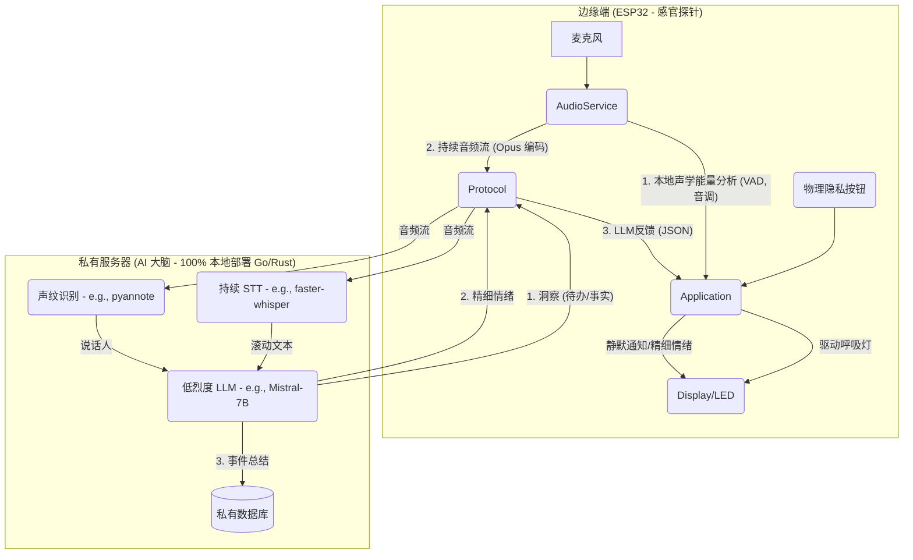

# 心镜 (Heart Mirror)

## 愿景 (Vision)

“心镜”是一个 100% 私有化、用于自我觉察和认知增强的环境 AI。

它不是一个助手，而是一面镜子。

市面上所有的 AI 助手都是“命令驱动”的仆人：您下达指令，它执行任务。这满足了“效率”，但忽略了一个更深层次的需求：我们对自己实时的情绪和精神状态，其实非常“无知”。

“心镜”的核心价值不是“服务”，而是“自省”。它是一个环境计算设备，其唯一目标是：

- 绝对私密地感知您所处的环境。

- 被动地、静默地为您分析和量化您的状态。

## 核心原则 (Core Principles)

- 隐私基石 (Privacy-First)：任何原始音频数据永远不会离开您的私有网络。所有 AI 分析均在您的私有服务器（如 NAS、NUC 或家用服务器）上运行的本地 LLM/STT 模型上完成。

- 用户主权 (User Sovereignty)：用户必须能在首次启动时，通过透明的界面（WiFi 门户）自由配置自己的 WiFi 凭据（包括 WPA2-Enterprise 用户名）和私有服务器地址。

- 被动感知 (Passive Perception)：设备的主要模式不是等待唤醒词，而是持续地、低功耗地感知环境。

- 环境计算 (Ambient Computation)：反馈是静默且非侵入性的。Display 主要用于“氛围灯”和“无声通知”，而非吵闹的语音播报。

## 核心架构：边缘（探针）+ 私服（大脑）

## 功能特性 (Features)

- 可配置的私有部署 (Configurable Private Deployment)：在首次启动时，设备将进入配置门户（Captive Portal），允许用户输入 WPA2-Enterprise（用户名 + 密码）凭据，以及自定义的私有服务器 WebSocket URL。

- 本地能量呼吸灯 (Local Energy Breathing Light)：ESP32 在本地持续分析声学“能量”（语音密度、音调起伏），而非猜测情绪。Display 以此为依据，呈现一个非侵入性的“环境氛围灯”。

- 精细情绪反馈 (Fine-grained Emotion Feedback)：私有 LLM 实时分析您的内容（例如识别到“愤怒”词汇），并立即决策一个“反馈”情绪。它会发送一个 xiaozhi 原生支持的指令（{"type": "llm", "emotion": "fear"}），使设备立即显示“恐惧”或“安抚”的表情。

- 情绪日志 (Emotion Log)：私有 LLM 结合文本内容和说话人声纹，判断“强情绪事件”，并将其（例如 `[李四]: 愤怒 - "..."`）存入您的私有数据库，供您日后回顾。

- 物理隐私开关 (Physical Privacy Switch)：一个物理按钮，按下后立即在固件层停止 AudioService 的音频流传输，Display 必须显示“已静音”图标，100% 保证用户信任。

## 里程碑 (Milestone)

### Milestone 0: 基金会 (The Foundation: Refactor & Configuration)

**目标**：剥离 xiaozhi 的冗余代码，并实现用户可配置的私有化部署。这是所有后续功能的基础。

#### Task F-0.1 (固件): 固件精简

- **描述**：移除 xiaozhi 针对几十种开发板的硬件抽象层（HAL），精简为一个专注的固件。
- **行动**：
  1. 删除 `main/boards/` 目录。
  2. 创建 `main/heart_mirror_board.h`，硬编码目标 ESP32 板（如 DevKitC）的 I2S 麦克风、SPI LCD 和物理隐私按钮的引脚。
  3. 精简 `main/idf_component.yml`，只保留 `esp-sr`、`esp-opus-encoder`、`lvgl`、`button` 等核心依赖。
  4. 在 `application.cc` 中，移除 `Board::GetInstance()` 依赖，替换为对 `heart_mirror_board.h` 的直接调用。

#### Task F-0.2 (固件): 移除公有云依赖

- **描述**：彻底移除所有 xiaozhi 原有的公有云激活、OTA 检查和资产下载逻辑。
- **行动**：
  1. 从 `application.cc` 的 `Start()` 方法中删除 `CheckNewVersion()` 和 `CheckAssetsVersion()` 的调用。
  2. `Protocol` 的初始化将不再依赖 `ota.Has...Config()`。

#### Task F-0.3 (固件): 加载私有配置

- **描述**：修改 `Application::Start`，使其在连接网络后，从 NVS 加载并使用配置。
- **行动**：
  1. 在 `Start()` 中，网络连接成功后，使用 `Settings settings("heart-mirror", true);` 读取 `server_url`。
  2. 如果 `server_url` 为空，应显示错误并强制重启进入配置门户。
  3. 修改 `WebsocketProtocol`（或您选择的协议）的构造函数，使其接受一个 `std::string server_url`。
  4. 使用加载的 URL 初始化 `protocol_`：`protocol_ = std::make_unique<WebsocketProtocol>(server_url);`。

#### Task F-0.4 (固件): 加载私有配置

- **描述**：修改 `Application::Start`，使其在连接网络后，从 NVS 加载并使用配置。
- **行动**：
  1. 在 `Start()` 中，网络连接成功后，使用 `Settings settings("heart-mirror", true);` 读取 `server_url`。
  2. 如果 `server_url` 为空，应显示错误并强制重启进入配置门户。
  3. 修改 `WebsocketProtocol`（或您选择的协议）的构造函数，使其接受一个 `std::string server_url`。
  4. 使用加载的 URL 初始化 `protocol_`：`protocol_ = std::make_unique<WebsocketProtocol>(server_url);`。

### Milestone 1: 核心管道（持续串流与转录）

**目标**：实现 ESP32 到私有服务器的 7x24 持续音频流，并在服务器端成功转录为文本。

#### Task F-1.1 (固件): 实现“心镜”模式与持续串流

- **描述**：在 `application.h` 中添加新状态 `kDeviceStateHeartMirror`。实现一个按钮（如 `ToggleChatState`）来进入此模式。
- **行动**：修改 `SetDeviceState`：当进入 `kDeviceStateHeartMirror` 状态时，调用 `audio_service_.EnableVoiceProcessing(true)` 和 `protocol_->OpenAudioChannel()`。这将自动、持续地触发 `MAIN_EVENT_SEND_AUDIO` 事件，从而复用 `protocol_->SendAudio()` 管道。

#### Task S-1.1 (服务器): 构建音频接收服务 (Go/Rust)

- **描述**：使用 Go（`gorilla/websocket`）或 Rust（`tungstenite`）构建一个 WebSocket 服务器，以接收 M-0.4 中配置的 URL 连接。
- **行动**：服务器必须能解析 xiaozhi 的音频包（JSON 头 + Opus 二进制包）。

#### Task S-1.2 (服务器): 集成 STT 管道

- **描述**：将接收到的 Opus 音频流解码并送入本地 STT 引擎。
- **行动**：使用 libopus 的 FFI (C 绑定) 解码 Opus 数据包，并将 PCM 音频流实时喂给本地 faster-whisper 实例。
- **验证**：能够在服务器控制台看到 ESP32 端生成的实时滚动字幕。

### Milestone 2: 双向反馈（呼吸灯与精细情绪）

**目标**：实现 ESP32 端的本地能量分析，并打通从“私服 LLM”到“ESP32 表情”的精细反馈。

#### Task F-2.1 (固件): 本地能量呼吸灯

- **描述**：`AudioService` 在串流（M-1.1）的同时，也进行本地计算。
- **行动**：
  1. 修改 `audio_service.cc`，利用 `esp-sr` 的 VAD 状态计算一个滚动的“声学能量”指标（如语音密度）。
  2. `Application` 定期获取此指标，并将其映射为颜色，调用 `display->SetEmotion` 来驱动 Display 氛围灯。

#### Task S-2.1 (服务器): 集成 LLM 与情绪 Prompt

- **描述**：将 STT 文本流（来自 S-1.2）输入到本地 LLM（例如 llama.cpp 的 Go/Rust 绑定）。
- **行动**：编写 Prompt，使 LLM 能从输入文本中识别“高能量”情绪（如“愤怒”、“喜悦”），并决策一个“反馈”情绪（如“恐惧”）。

#### Task S-2.2 (服务器): 实现“精细情绪”反馈

- **描述**：将 LLM 的决策（JSON）发回给 ESP32。
- **行动**：服务器向 ESP32 发送一个标准 xiaozhi 格式的 JSON 指令：`{"type": "llm", "emotion": "fear"}`。
- **验证**：`Application::OnIncomingJson` 无需修改即可自动解析此指令，并调用 `display->SetEmotion("fear")`，使屏幕立即显示表情。

### Milestone 3: 信任与日志（隐私闭环）

**目标**：实现物理隐私开关，并开始进行有意义的长期日志记录。

#### Task F-3.1 (固件): 物理隐私开关

- **描述**：实现一个绝对可靠的“关闭”功能。
- **行动**：
  1. 在 `heart_mirror_board.h` (来自 M-0.1) 中定义一个 `PRIVACY_BUTTON_GPIO`。
  2. 在 `Application::Start` 中为此 GPIO 注册一个中断。
  3. 中断处理函数应立即调用（或通过 Schedule 调用）一个函数，该函数：
      - 停止 AudioService（`EnableVoiceProcessing(false)`）。
      - 关闭 Protocol 的音频通道。
      - 调用 `display->SetEmotion("sleep")` 或显示“静音”图标。

#### Task S-3.1 (服务器): 集成声纹识别

- **描述**：在 STT（S-1.2）的同时，运行声纹识别，以便 LLM 知道“谁在说话”。
- **行动**：集成 pyannote.audio（或同类库），将 STT 输出从 "..." 升级为 "[Speaker_A]: ..."。将此信息提供给 LLM（S-3.1）。

#### Task S-3.2 (服务器): 事件日志数据库

- **描述**：LLM 识别出的“强情绪事件”需要被持久化。
- **行动**：
  1. 在服务器端设置一个数据库（例如 PostgreSQL 或 SQLite）。
  2. 当 LLM（S-3.1）识别到高能量情绪时，将 `{timestamp, speaker, emotion_label, transcript_snippet}` 写入数据库。
