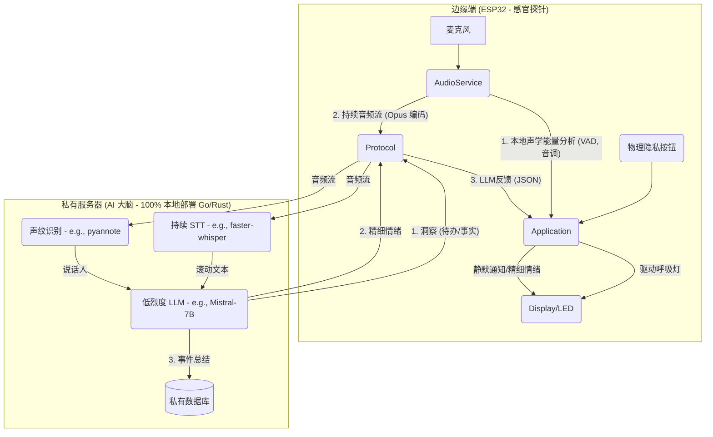

# 心镜 (Heart Mirror)

## 愿景 (Vision)

“心镜”是一个 100% 私有化、用于自我觉察和认知增强的环境 AI。

它不是一个助手，而是一面镜子。

市面上所有的 AI 助手都是“命令驱动”的仆人：您下达指令，它执行任务。这满足了“效率”，但忽略了一个更深层次的需求：我们对自己实时的情绪和精神状态，其实非常“无知”。

“心镜”的核心价值不是“服务”，而是“自省”。它是一个环境计算设备，其唯一目标是：

- 绝对私密地感知您所处的环境。

- 被动地、静默地为您分析和量化您的状态。

## 核心原则 (Core Principles)

- 隐私基石 (Privacy-First)：任何原始音频数据永远不会离开您的私有网络。所有 AI 分析均在您的私有服务器（如 NAS、NUC 或家用服务器）上运行的本地 LLM/STT 模型上完成。

- 用户主权 (User Sovereignty)：用户必须能在首次启动时，通过透明的界面（WiFi 门户）自由配置自己的 WiFi 凭据（包括 WPA2-Enterprise 用户名）和私有服务器地址。

- 被动感知 (Passive Perception)：设备的主要模式不是等待唤醒词，而是持续地、低功耗地感知环境。

- 环境计算 (Ambient Computation)：反馈是静默且非侵入性的。Display 主要用于“氛围灯”和“无声通知”，而非吵闹的语音播报。

## 核心架构：边缘（探针）+ 私服（大脑）

## 功能特性 (Features)

- 可配置的私有部署 (Configurable Private Deployment)：在首次启动时，设备将进入配置门户（Captive Portal），允许用户输入 WPA2-Enterprise（用户名 + 密码）凭据，以及自定义的私有服务器 WebSocket URL。

- 本地能量呼吸灯 (Local Energy Breathing Light)：ESP32 在本地持续分析声学“能量”（语音密度、音调起伏），而非猜测情绪。Display 以此为依据，呈现一个非侵入性的“环境氛围灯”。

- 精细情绪反馈 (Fine-grained Emotion Feedback)：私有 LLM 实时分析您的内容（例如识别到“愤怒”词汇），并立即决策一个“反馈”情绪。它会发送一个 xiaozhi 原生支持的指令（{"type": "llm", "emotion": "fear"}），使设备立即显示“恐惧”或“安抚”的表情。

- 情绪日志 (Emotion Log)：私有 LLM 结合文本内容和说话人声纹，判断“强情绪事件”，并将其（例如 `[李四]: 愤怒 - "..."`）存入您的私有数据库，供您日后回顾。

- 物理隐私开关 (Physical Privacy Switch)：一个物理按钮，按下后立即在固件层停止 AudioService 的音频流传输，Display 必须显示“已静音”图标，100% 保证用户信任。
